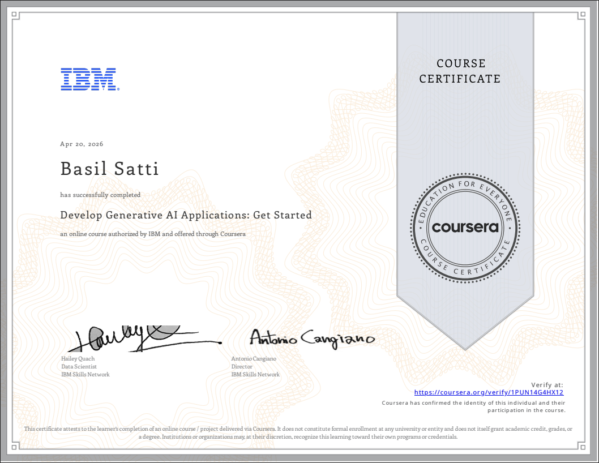
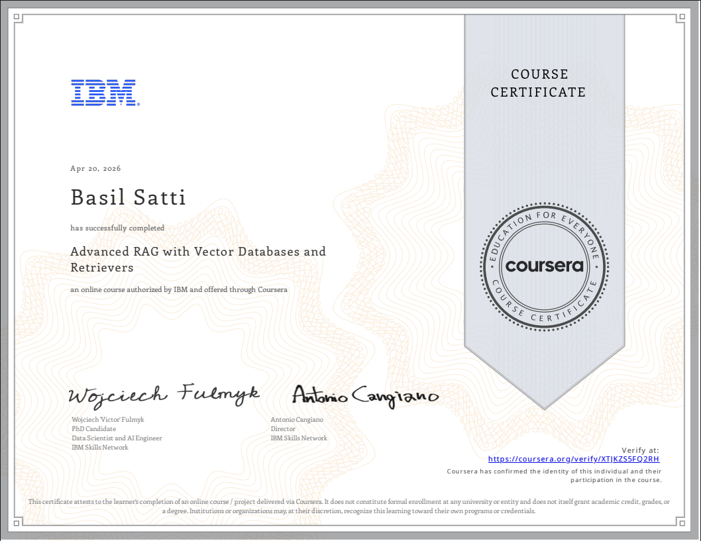
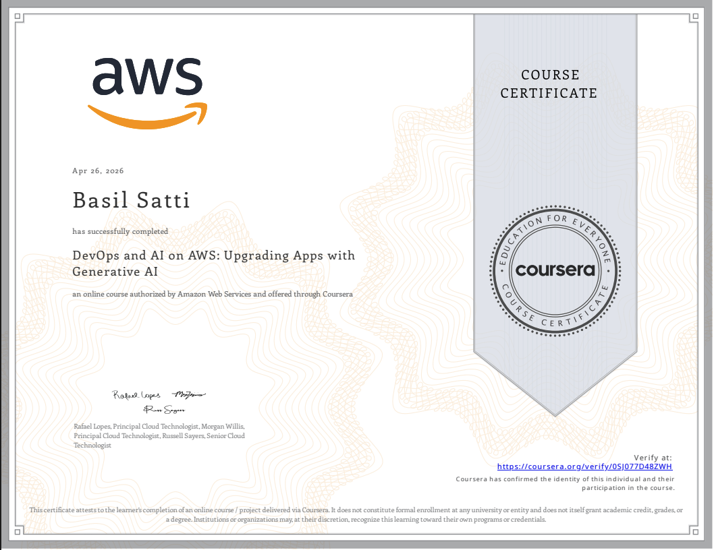
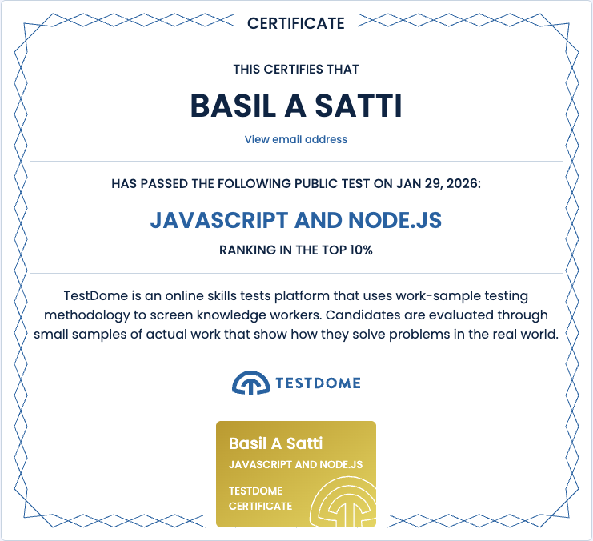

---

## 🧑‍💻 About Me

> Senior Software Engineer focused on **backend architecture**, **cloud infrastructure**, and **applied AI**. I build scalable microservices, APIs, RAG-based AI systems, and automation pipelines using Node.js, Python, AWS, MongoDB, OpenSearch, and Qdrant. I turn complex technical problems into reliable, production-ready systems with strong emphasis on clean code, performance, and operational excellence.

<table>
<tr><td>🌍 <b>Location</b></td><td>KSA</td></tr>
<tr><td>🚀 <b>Currently at</b></td><td><a href="http://kleem.io">Kleem IO</a></td></tr>
<tr><td>✉️ <b>Email</b></td><td><a href="mailto:satti.basil@gmail.com">satti.basil@gmail.com</a></td></tr>
<tr><td>🤝 <b>Open to collaborate on</b></td><td>RAG · ModularRAG · Agent Orchestration · System Architecting · DevOps</td></tr>
</table>

---

## 🛠️ Tech Stack

<table><tr>
<td align="center"></td>
<td align="center"></td>
<td align="center"></td>
<td align="center"></td>
<td align="center"></td>
<td align="center"></td>
<td align="center"></td>
<td align="center"></td>
<td align="center"></td>
<td align="center"></td>
<td align="center"></td>
<td align="center"></td>
<td align="center"></td>
<td align="center"></td>
<td align="center"></td>
</tr></table>

---

## 📜 Certifications

<table>
<tr>
<td align="center">
  
   <b>Generative AI Fundamentals</b>
   IBM · Coursera
</td>
<td align="center">
  
   <b>RAG & LLM Applications</b>
   IBM · Coursera
</td>
<td align="center">
  
   <b>AWS DevOps &amp; AI</b>
   AWS · Coursera
</td>
</tr>
<tr>
<td align="center">
  
   <b>Node.js</b>
   TestDome
</td>
<td align="center">
  
   <b>Saudi Engineering License</b>
   Saudi Council of Engineers
</td>
<td></td>
</tr>
</table>

---

## 📊 GitHub Stats

 

 

&nbsp;

 

---

## 🔗 Connect

<a href="https://www.github.com/baselka" target="_blank" rel="noreferrer">
  <picture>
    <source media="(prefers-color-scheme: dark)" srcset="https://raw.githubusercontent.com/danielcranney/readme-generator/main/public/icons/socials/github-dark.svg" />
    <source media="(prefers-color-scheme: light)" srcset="https://raw.githubusercontent.com/danielcranney/readme-generator/main/public/icons/socials/github.svg" />
    
  </picture>
</a>&nbsp;
<a href="https://www.linkedin.com/in/basil-satti" target="_blank" rel="noreferrer">
  <picture>
    <source media="(prefers-color-scheme: dark)" srcset="https://raw.githubusercontent.com/danielcranney/readme-generator/main/public/icons/socials/linkedin-dark.svg" />
    <source media="(prefers-color-scheme: light)" srcset="https://raw.githubusercontent.com/danielcranney/readme-generator/main/public/icons/socials/linkedin.svg" />
    
  </picture>
</a>&nbsp;
<a href="https://www.x.com/SattiBasil55340" target="_blank" rel="noreferrer">
  <picture>
    <source media="(prefers-color-scheme: dark)" srcset="https://raw.githubusercontent.com/danielcranney/readme-generator/main/public/icons/socials/twitter-dark.svg" />
    <source media="(prefers-color-scheme: light)" srcset="https://raw.githubusercontent.com/danielcranney/readme-generator/main/public/icons/socials/twitter.svg" />
    
  </picture>
</a>&nbsp;
<a href="https://www.stackoverflow.com/users/10251064" target="_blank" rel="noreferrer">
  <picture>
    <source media="(prefers-color-scheme: dark)" srcset="https://raw.githubusercontent.com/danielcranney/readme-generator/main/public/icons/socials/stackoverflow-dark.svg" />
    <source media="(prefers-color-scheme: light)" srcset="https://raw.githubusercontent.com/danielcranney/readme-generator/main/public/icons/socials/stackoverflow.svg" />
    
  </picture>
</a>

